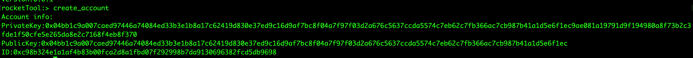
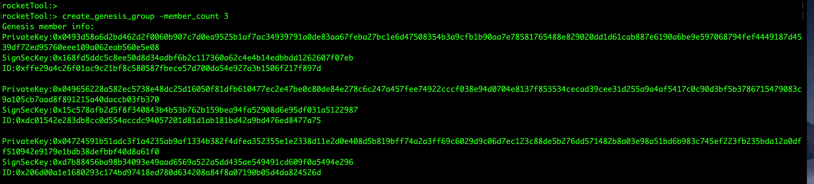
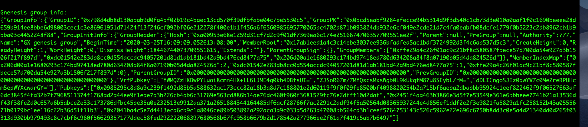
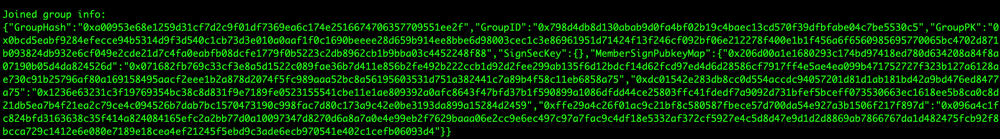

# Rocket Tool
该项目是Rocket Node使用时的辅助工具，包含如下功能：
* 生成新的Rocket账户。
* 生成新的创始组信息。

### 使用说明
1.使用项目代码进行编译，得到可执行文件。  
2.运行可执行文件tool，进入命令行界面，输入命令进行交互操作。

### 命令说明
##### 1.help
显示所有的命令以及命令作用

##### 2.version
查看工具版本号

##### 3.create_account
创建新的Rocket账户，包含账户的私钥以及申请矿工所需要的信息

##### 4.create_genesis_group
创建新的Rocket创始组。
-member_count 参数用来指定创始组成员的数量，默认是3。

该命令生成如下内容:  
(1)创始组成员信息，包含私钥，创始组成员签名私钥和账户ID

(2)创始组描述信息

(3)每个创始组成员加入的组信息

