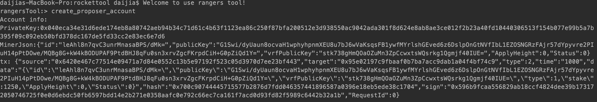
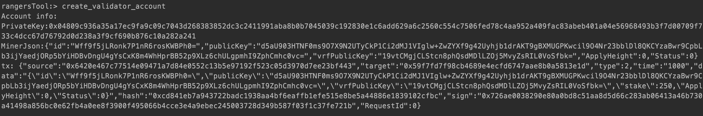
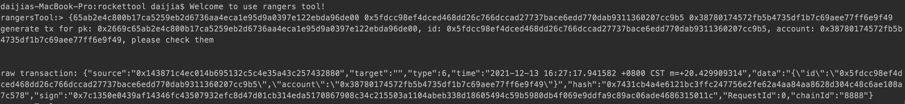
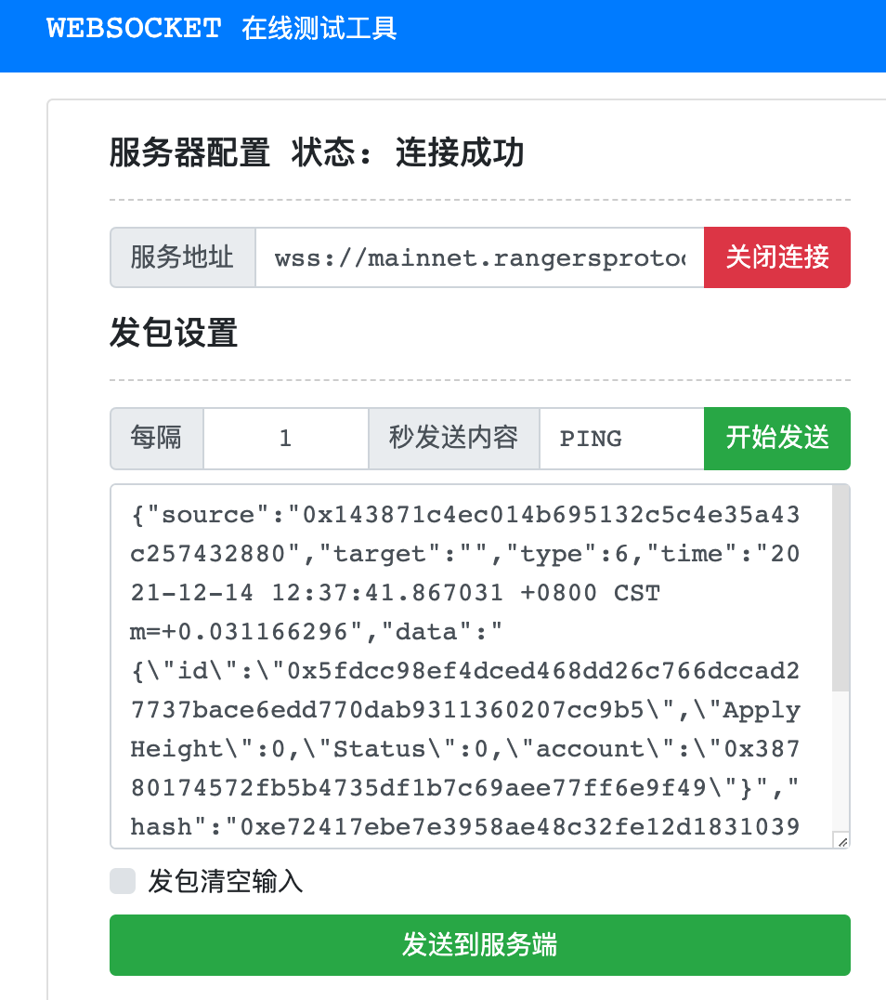

# Rangers Tool
该项目是Rangers Node使用时的辅助工具，包含如下功能：
* 生成新的Rangers账户。
* 生成新的创始组信息。

### 使用说明
1.使用项目代码进行编译，得到可执行文件。  
2.运行可执行文件tool，进入命令行界面，输入命令进行交互操作。

### 命令说明
##### 1.help
显示所有的命令以及命令作用

##### 2.version
查看工具版本号

##### 3.create_account
创建新的Rangers账户，包含账户的私钥以及申请矿工所需要的信息

##### 4.create_proposer_account
创建新的Rangers账户，包含账户的私钥以及申请提案矿工所需要的信息

##### 5.create_validator_account
创建新的Rangers账户，包含账户的私钥以及申请验证矿工所需要的信息

##### 6.create_genesis_group
创建新的Rangers创始组。
-member_count 参数用来指定创始组成员的数量，默认是3。

该命令生成如下内容:  
(1)创始组成员信息，包含私钥，创始组成员签名私钥和账户ID

(2)创始组描述信息

(3)每个创始组成员加入的组信息

##### 7.create_miner_reward
创建更改矿工收益账号的交易原文，需要提供当前收益账号的私钥、矿工id（可在下表查询）、新的收益账号

简单的实例如下：

此处的"raw transaction" 后的信息，即为要发送的交易原文。

交易可通过标准的ws客户端发送给rangersprotocol网络，完成变更收益账户的操作。实例如下：

ws的链接为： wss://mainnet.rangersprotocol.com/pubhub/api/writer

|  矿工id   | 初始收益账户  |
|  ----  | ----  |
|0x2b01929013cdebed34a6aa99abb8ea5f6676585198882894e99e4df448e75de2 |0xf2b86a27c3cf595f1dfc77adfb9588e32b244186  |
|0xd78a2def374f66d0a5ddc5a26faed78510593a513ce2377f5e7d53c38d754b9e   |0xfd20013b456865246cd8f36ef43be0030e673ddd  |
|0x5b8fa4914cf8eca1714647e623e2fede83e09c3f8c3742b45b8f51fd485ce22e   |0xfcc7d5aa2942894234a942272fba50951c7fd0c0  |
|0x3b1cd6589e4b62ad98ebf2ece94ef2253e9befe1b6322aecd342b9ea9f1ea0fa   |0xaf59f00a17123d5c223c98ed71360c02064acbf7  |
|0x76aa6b30168c4d169effeb6934dc2d83923e934ddc9461b05e71f32463edc39e   |0xb8a91cb3cbdc1909d88dedb138362b1050f743ca  |
|0x98c23e0baa546e2ead8aa46daf8b7cc2dc3422a541bf15eabd4411ba1cfde61f   |0x0e7f47cd54aa66b69049ee543605b39876830ce6  |
|0x844bfe9ef3b798bd558256ec5955d5d20ea461e3ef99b0421c7e584caae0b0fc   |0x361973b04435cd72c0162601b7f65745656f7613  |
|0x68e1cb6a6c3c467860713d7de82a007dde8cedf5990f01823fb549fa2343a216   |0x156a3f76ffe55fa7f2bae306b6da05ddaf769298  |
|0x802753165930ab14274f774f5be411538474b9a345a6b1803c531ad9e9615e38   |0xc419c0861a0653e7a7def0a52130b42bd53b6569  |
|0x41b76935e4ce7016aca1f75e8de85d3fa2c92e16175754b65fc53a8ba00f6de9   |0x2868a56e20e167c07e97f214f730bf33c67ba0f4  |
|0x82333d4a115ada7cb79d08f98ddffe87bdf77029871ef8e769dc965ae6dcf5b9   |0x90ffbc662a1d2853026ef75f8f43aab3594e22ff  |
|0x858978878fb7a268bb9ade492bb71fbd563032aeb6a6e484ad838f656684831d   |0x0c8ee0183058494b9c06619c6cd7840c9ce05b9d  |
|0x9b1a7648051e3543c3782d52b6aa73ce264d2a2656e380aa594ef0b55aa30c86   |0x6d4d0432b83201e5bb7f22075655f2ebe637f0eb  |
|0xd76038619814e2bf67cd5234c2decd4f04862d9b140bff8e510582a36ac383d0   |0x84e056985c45e4de9f28499fb23facde92999309  |
|0x5c448198a659a5f3a4fb77bc58e5405940b852d429d13d2656fc510f8f11265a   |0xbfc5f31e40b42dad579e4fc433cda987e44064c1  |
|0x303f57dc44068f22e81b00f3c759e1a31e371ca119f8ca135345b0851e8e20f4   |0x033e61266a278a7248229ba565b6c236b7d30b7c  |
|0x8c08ca4477b26f8ba5b96f7c76dc5bbea702cccebdcd71f91c96c973dc5677d2   |0xf88c7763aca3fc3d46867c8c605d4a636ddc43dc  |
|0x450233af5bf35351a7f5f75ddc919481f3cbccc5c8acca94f5f655d6481a1637|0x0e05d86e7943d7f041fabde02f25d53a2aa4cc29  |
|0x5bcbcbdba33211edd4307c831f97976191dba9ebb74633923ccf2849f5c18308   |0xe9b59d7af13bf6d3f838da7f73c2e369802ea211  |
|0x8689719d636a7e945c81f51d7dd061b6dfdf4f1b72e197471c8b0fbfe402f416   |0x1aab2207e31dff81240fc4976c301ab0a0e0da26  |
|0x4e550c28e8ead9f6abd081b5c33a10deeb24c43e821aaba6ea40bf29d83702a9   |0x46ee7dafba4797d76565a730c64ab92b08b47eb5  |
|0x8eb32fa87153b67dfd5981266899a5613b58b054de55c9b986148f83f5305878   |0xda686b9b5ad32404a2d1d9b1e4f84e67f72a884a  |
|0x90e1f3e6aea5e1cdf7882a842dc1582bc100da1ae013a3ec3468ad87e9e66a8d   |0xaeab1151cb42756cbd409269154c0461c9c3df3b  |
|0x87f5a6225496d8231feb18591c8de325fbfb21d90b78a860997c7f8915990f41   |0x7f0746723b141b79b802eb48eb556178fd622201  |
|0x2fd9ac354a85b859986fa1efde3f988f7001491e3ee6b367fc4df97c728ece6b   |0xaba4ede96364f129baa98f112f636842a676b9bf  |
|0x529b74731048645faae815b27885e217bd52e4bd51fdb6b3d7de5ef74a2fe037   |0x1f3a2e8f07be5839005c6d1997358684066f593f  |
|0x8e83b60d2df2bc07ca68038a44e3b528125001375ecda253847a73d133152eb0   |0xfcda6f6d16d0c31234c51dc15bf71b3242b09763  |
|0x5b263345bb4486f8011dc3bab84e85eff520123acaac07c77b9fa1721150a43a   |0xc2eb24387458baebcf7f8517c2a38cf96fba704f  |
|0x627c3cc4f76e396391e6783c46e652df5ee91147c42bc782714182ae0dd3172b   |0xfae00bc664af03a99ec3a4ae3194e4bdac093450  |
|0x5ab27bb391314f4abeb2adc3de5e9230cf3b842f8ce166785a135318e5227f67   |0x7759e04cc420a6d5c12aca77e045e82ca6a55730  |
|0xc8176f7e025e02107dd6a7e6e6b5e8a620f7fa67ad28d071ff0f5cb802ff3f3d   |0x8192d698b4fa840a33e4a44aeee32f3671c8956e  |
|0x573510dbd33b211f231dc215ceb100292453db84bfcc1ccb9d66f9cbc63d875e|0x8cd20feb1b8c7e5378ab1b0f6d68846b29d4f0be  |
|0x77bf71b9352ef886783bd7a9c0eddc9827c35505c4f792706fb89b6894aefeab|0xb4ca0fbec728a32845d4c44fdfb3df05645f5229  |
|0x0c5a7fd40963705372dd7187c79b4b7645d8df29c39ee2a85c6d5c638b608350|0x6ca0685b1f337ee1503ed83d2299b925adc9b804  |

